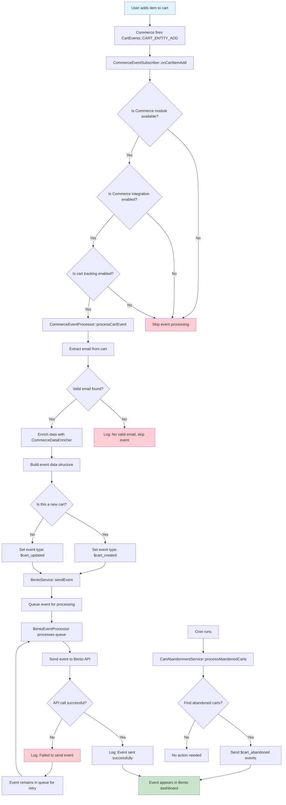

# Bento SDK for Drupal 10


> [!TIP]
> Need help? Join our [Discord](https://discord.gg/ssXXFRmt5F) or email jesse@bentonow.com for personalized support.

The Bento SDK for Drupal 10 makes it easy to send events, manage subscribers, and send transactional emails from your Drupal site using Bento’s API. Designed for both technical and non-technical users, this module provides a simple admin UI and a robust PHP API for developers.

---

Table of contents
=================
<!--ts-->
* [Features](#features)
* [Requirements](#requirements)
* [Getting Started](#getting-started)
    * [Installation](#installation)
    * [Configuration](#configuration)
* [Usage](#usage)
    * [Send Events](#send-events)
    * [Subscriber Management](#subscriber-management)
    * [Transactional Email](#transactional-email)
    * [Email Validation](#email-validation)
    * [Tag & Field Management](#tag--field-management)
* [Events Queue and Processing](#events-queue-and-processing)
* [Webform Integration](#webform-integration)
* [Things to Know](#things-to-know)
* [Support](#support)
* [Contributing](#contributing)
* [License](#license)
<!--te-->

## Features

* **Easy Drupal Integration**: Seamless admin UI for configuration and management
* **Event Tracking**: Send custom events to Bento from your Drupal site
* **Subscriber Management**: Create, import, and update subscribers with tags and fields
* **Transactional Email**: Send emails via Bento, with fallback to Drupal’s default mail system
* **Email Validation**: Validate emails using Bento’s API
* **Secure by Default**: Credentials stored securely, with best-practice logging and sanitization

## Requirements

- Drupal 10.2 or higher
- PHP 8.1 or higher
- Composer (for dependency management)
- Bento API credentials (get these from your [Bento dashboard](https://app.bentonow.com))
  - **Site UUID**: 32-character hexadecimal string (e.g., `2103f23614d9877a6b4ee73d28a5c61d`) or standard UUID format with hyphens

## Getting Started

### Installation

#### Option 1: Drupal Admin UI (Recommended for non-technical users)
1. Download the module ZIP from the [Bento SDK releases page](https://github.com/bentonow/bento-drupal-sdk/releases).
2. In your Drupal admin, go to **Extend > Install new module**.
3. Upload the ZIP file and click **Install**.
4. Go to **Extend** and enable "Bento SDK".

#### Option 2: Composer (Recommended for developers)
1. In your Drupal root, run:
   ```bash
   composer require bentonow/bento-drupal-sdk
   ```
2. Enable the module via the admin UI or with Drush:
   ```bash
   drush en bento_sdk
   ```

### Configuration

1. In Drupal, go to **Configuration > Bento > Settings** (`/admin/config/bento/settings`).
2. Enter your **Site UUID** (32-character hex string or UUID format), **Publishable Key**, and **Secret Key** (from your Bento account).
3. (Optional) Enable **Route Drupal emails through Bento** to send all site emails via Bento.
4. (Optional) Enable **Email Validation** to check emails before sending.
5. Click **Save**.

> **Security Note:**
> For production, store your secret key in the `BENTO_SECRET_KEY` environment variable for maximum security.

---

## Usage

Once configured, you can use the SDK in custom modules or via the admin UI.

### Send Events
Send custom events to Bento (e.g., user registration, purchases):
```php
$bento = \Drupal::service('bento.sdk');
$bento->sendEvent([
  'type' => 'user_registration',
  'email' => 'user@example.com',
  'fields' => [
    'first_name' => 'John',
    'last_name' => 'Doe',
  ],
]);
```

### Subscriber Management
Create a subscriber:
```php
$bento->createSubscriber([
  'email' => 'user@example.com',
  'first_name' => 'John',
  'last_name' => 'Doe',
  'tags' => 'lead,customer',
]);
```
Import multiple subscribers:
```php
$bento->importSubscribers([
  [
    'email' => 'user1@example.com',
    'first_name' => 'Alice',
    'tags' => 'beta',
  ],
  [
    'email' => 'user2@example.com',
    'first_name' => 'Bob',
    'tags' => 'customer',
  ],
]);
```

### Transactional Email
Send a transactional email:
```php
$bento->sendTransactionalEmail([
  'to' => 'user@example.com',
  'subject' => 'Welcome to our site',
  'html_body' => '<p>Hello John, welcome!</p>',
  'text_body' => 'Hello John, welcome!',
  'personalizations' => [
    'first_name' => 'John',
  ],
]);
```

#### How Email Sending Works
- **Flexible Email Delivery:** This module uses Drupal's built-in, flexible email system. You can choose to send all your site's emails through Bento with a simple setting in the admin panel.
- **Automatic Fallback:** If for any reason Bento can't send an email (for example, if your credentials are missing or there's a temporary issue), the system will automatically use Drupal's regular email method instead. This means your emails will always be sent, with no extra work needed from you.

#### Author Selection

The Bento SDK provides an intuitive author selection system for managing verified sender email addresses for transactional emails.

##### How It Works

When you enable email routing through Bento, you must select a verified sender email address (author) from your Bento account. The system automatically fetches and caches the list of available authors from your Bento account.

```php
// Fetch available authors programmatically
$bento = \Drupal::service('bento.sdk');
$authors = $bento->fetchAuthors();
// Returns: ['verified@yourdomain.com', 'noreply@yourdomain.com', ...]

// Send email with specific author
$bento->sendTransactionalEmail([
  'to' => 'user@example.com',
  'from' => 'verified@yourdomain.com', // Must be in authors list
  'subject' => 'Welcome!',
  'html_body' => '<p>Hello!</p>'
]);
```

##### Configuration

1. **Enable Email Routing**: Go to **Configuration > Bento > Settings** and enable "Route Drupal emails through Bento"
2. **Select Default Author**: Choose a verified sender email from the dropdown list
3. **Refresh Authors**: Use the "Refresh Authors" button to update the list with newly verified emails

##### Author Management Features

- **Automatic Fetching**: Authors are automatically loaded from your Bento account via API
- **Smart Caching**: Author lists are cached for 1 hour to improve performance
- **AJAX Refresh**: Update the authors list without page reload using the refresh button
- **Real-time Validation**: Selected authors are validated against the current list from Bento
- **Cache Invalidation**: Author cache is automatically cleared when API credentials change

##### Fallback Chain

The system uses a smart fallback chain for sender addresses:

1. **Explicit From Address**: If specified in the email call
2. **Default Author**: The author selected in configuration
3. **System Fallback**: Drupal's default site email if Bento is unavailable

##### Security and Validation

- **Email Verification**: Only verified sender addresses from your Bento account can be used
- **Real-time Validation**: Selected authors are validated against the fetched list
- **Secure API Calls**: Author fetching uses your secure API credentials
- **Permission Control**: Only users with appropriate permissions can modify author settings

##### Troubleshooting

**Common Issues:**

1. **Empty Authors List**: 
   - Check that your API credentials are correct
   - Verify that you have verified sender addresses in your Bento account
   - Use the "Refresh Authors" button to reload the list

2. **Selected Author Not Available**: 
   - The author may have been removed from your Bento account
   - Refresh the authors list to get the current available options
   - Check that the email address is still verified in Bento

3. **Authors Not Loading**:
   - Verify API connectivity and credentials
   - Check Drupal logs for specific error messages
   - Ensure your Bento account has the necessary permissions

**Debugging:**

```php
// Check if authors can be fetched
$bento = \Drupal::service('bento.sdk');
if ($bento->isConfigured()) {
  $authors = $bento->fetchAuthors();
  if (empty($authors)) {
    // Check logs for API errors
    // Verify Bento account has verified senders
  }
}

// Clear authors cache if needed
$bento->clearAuthorsCache();
```

The author selection system ensures that all emails sent through Bento use verified sender addresses, maintaining deliverability and compliance with email authentication standards.

#### Test Email Configuration

The Bento SDK includes a built-in test email functionality that allows you to validate your transactional email configuration directly from the admin interface.

##### How It Works

The test email feature provides a simple way to verify that your Bento integration is working correctly by sending a test email through the configured system.

```php
// Check if test email can be sent programmatically
$bento = \Drupal::service('bento.sdk');
$config = \Drupal::config('bento_sdk.settings');

// Verify prerequisites
$can_send = $bento->isConfigured() && 
           !empty($config->get('default_author_email')) &&
           filter_var($config->get('default_author_email'), FILTER_VALIDATE_EMAIL);

// Send test email programmatically
if ($can_send) {
  $success = $bento->sendTransactionalEmail([
    'to' => $config->get('default_author_email'),
    'from' => $config->get('default_author_email'),
    'subject' => 'Test Email from Bento SDK',
    'html_body' => '<p>This is a test email from Bento SDK.</p>',
    'text_body' => 'This is a test email from Bento SDK.',
  ]);
}
```

##### Prerequisites

Before you can send test emails, ensure the following requirements are met:

1. **API Credentials Configured**: Site UUID, Publishable Key, and Secret Key must be properly set
2. **Email Routing Enabled**: "Route Drupal emails through Bento" must be checked
3. **Author Selected**: A verified sender email must be selected from the dropdown
4. **User Permissions**: You must have the "administer bento sdk" permission
5. **Rate Limits**: You must not have exceeded the hourly test email limit

##### Using the Test Email Button

1. **Navigate to Settings**: Go to **Configuration > Bento > Settings** (`/admin/config/bento/settings`)
2. **Enable Email Routing**: Check "Route Drupal emails through Bento"
3. **Select Author**: Choose a verified sender email from the dropdown
4. **Send Test**: Click the "Send Test Email" button in the "Test Email Configuration" section

The interface provides real-time feedback:
- **Button State**: Shows whether test email can be sent or what's missing
- **Loading State**: Displays progress while sending
- **Success/Error Messages**: Provides immediate feedback on the test result

##### Rate Limiting System

To prevent abuse, the test email system includes built-in rate limiting:

- **Default Limit**: 5 test emails per hour per user
- **Per-User Tracking**: Each user has their own rate limit counter
- **Automatic Reset**: Counters reset every hour
- **Configurable**: Limit can be adjusted via `max_test_emails_per_hour` setting

```php
// Check current rate limit status
$form = new BentoSettingsForm();
$rate_limit = $form->checkTestEmailRateLimit();

if (!$rate_limit['allowed']) {
  $reset_time = date('H:i', $rate_limit['next_allowed']);
  echo "Rate limit exceeded. Try again after {$reset_time}";
}
```

##### AJAX Implementation

The test email functionality uses AJAX for a seamless user experience:

- **No Page Reload**: Tests are performed without refreshing the page
- **Real-time Feedback**: Immediate success or error messages
- **Loading States**: Visual indicators during processing
- **CSRF Protection**: Secure token validation for all requests

##### Error Handling and Feedback

The system provides detailed feedback for various scenarios:

**Success Messages:**
- "Test email sent successfully!" - Email was delivered to Bento

**Error Messages:**
- "No default author email configured" - Author selection required
- "API credentials not configured properly" - Missing or invalid credentials
- "Rate limit exceeded" - Too many test emails sent recently
- "Failed to send test email: [specific error]" - API or delivery issues

##### Troubleshooting

**Common Issues:**

1. **Button Disabled/Grayed Out**:
   - Check that API credentials are configured
   - Ensure an author email is selected
   - Verify you have the required permissions
   - Check if rate limit has been exceeded

2. **"API credentials not configured properly"**:
   - Verify Site UUID format (32-character hex or UUID with hyphens)
   - Check that Publishable Key and Secret Key are set
   - Ensure Secret Key is stored securely (environment variable recommended)

3. **"No default author email configured"**:
   - Select a verified sender email from the dropdown
   - Use "Refresh Authors" if the list is empty
   - Verify the email is verified in your Bento account

4. **Test Email Not Received**:
   - Check spam/junk folders
   - Verify the author email address is correct
   - Review Drupal logs for detailed error messages
   - Test with a different email address

**Debugging:**

```php
// Enable detailed logging for troubleshooting
$logger = \Drupal::logger('bento_sdk');

// Check last error from BentoService
$bento = \Drupal::service('bento.sdk');
$last_error = $bento->getLastError();

// Verify configuration status
$is_configured = $bento->isConfigured();
$config = \Drupal::config('bento_sdk.settings');
$author = $config->get('default_author_email');
```

##### Security Considerations

- **Permission-Based Access**: Only users with appropriate permissions can send test emails
- **Rate Limiting**: Prevents abuse and excessive API usage
- **CSRF Protection**: All AJAX requests include security tokens
- **Secure Credentials**: Secret keys should be stored in environment variables
- **Audit Trail**: All test email attempts are logged for security monitoring

The test email functionality provides a reliable way to validate your Bento integration and troubleshoot configuration issues before deploying to production.

### Email Validation
Validate a single email:
```php
$result = $bento->validateEmail('user@example.com');
if ($result['valid']) {
  // Email is valid
}
```
Validate multiple emails:
```php
$results = $bento->validateEmails([
  'user1@example.com',
  'user2@example.com',
]);
```

### Tag & Field Management
Add/remove tags:
```php
$bento->addTag('user@example.com', 'vip');
$bento->removeTag('user@example.com', 'old-tag');
```
Add/remove custom fields:
```php
$bento->addField('user@example.com', 'plan', 'pro');
$bento->removeField('user@example.com', 'plan');
```
Subscribe/unsubscribe/change email:
```php
$bento->subscribeUser('user@example.com');
$bento->unsubscribeUser('user@example.com');
$bento->changeEmail('old@example.com', 'new@example.com');
```

---

## Events Queue and Processing

The Bento SDK uses an asynchronous event processing system that queues events for background processing, ensuring optimal page load performance and reliable event delivery.

### How It Works

When you send events using the Bento SDK, they are automatically queued for background processing rather than being sent immediately. This approach provides several benefits:

- **Non-blocking Performance**: Page loads are not delayed by API calls to Bento
- **Reliability**: Events are persisted in the queue and will be processed even if there are temporary network issues
- **Automatic Retries**: Failed events are automatically retried with exponential backoff
- **Error Handling**: Permanently failed events are moved to a dead letter queue for investigation

### Queue Processing

Events are processed by Drupal's cron system using the `BentoEventProcessor` queue worker:

```php
// Events are automatically queued when you call sendEvent()
$bento = \Drupal::service('bento.sdk');
$bento->sendEvent([
  'type' => 'user_registration',
  'email' => 'user@example.com',
  'fields' => ['first_name' => 'John'],
]);
// Event is queued immediately and processed in the background
```

### Retry Mechanism

The SDK implements intelligent retry logic with exponential backoff:

- **Attempt 1**: Retry after 1 minute
- **Attempt 2**: Retry after 2 minutes  
- **Attempt 3**: Retry after 4 minutes
- **After 3 attempts**: Move to dead letter queue

The retry system distinguishes between temporary failures (network timeouts, rate limiting) and permanent failures (invalid data, authentication errors):

- **Retryable Errors**: Network timeouts, connection issues, rate limiting (429 errors), server errors (5xx)
- **Permanent Errors**: Invalid data, malformed requests, authentication failures, bad requests (4xx except 429)

### Configuration

Queue and retry settings can be configured in your `bento_sdk.settings.yml`:

```yaml
retry:
  max_attempts: 3           # Maximum retry attempts (default: 3)
  base_delay: 60           # Base delay in seconds (default: 60)
  max_delay: 300           # Maximum delay in seconds (default: 300)
  dead_letter_retention: 2592000  # Dead letter retention (default: 30 days)
```

### Monitoring and Management

#### Queue Statistics

You can monitor queue performance programmatically:

```php
$queue_manager = \Drupal::service('bento_sdk.queue_manager');
$retry_manager = \Drupal::service('bento_sdk.retry_manager');

// Get current queue size
$queue_size = $queue_manager->getQueueSize();

// Get retry statistics
$retry_stats = $retry_manager->getRetryStats();
// Returns: ['scheduled_retries' => 5, 'dead_letter_queue_size' => 2, 'max_attempts' => 3]
```

#### Processing Scheduled Retries

Scheduled retries are automatically processed during cron runs, but you can also trigger processing manually:

```php
$retry_manager = \Drupal::service('bento_sdk.retry_manager');
$retry_manager->processScheduledRetries();
```

#### Dead Letter Queue Management

Events that fail permanently are moved to a dead letter queue for investigation:

```php
// Check dead letter queue size
$dlq_size = $retry_manager->getRetryStats()['dead_letter_queue_size'];

// Items in the dead letter queue include:
// - Original event data
// - Error messages from all attempts
// - Timestamps and attempt counts
// - Final error that caused permanent failure
```

### Performance Considerations

- **Cron Frequency**: Ensure Drupal cron runs regularly (every 1-5 minutes) for timely event processing
- **Queue Size**: Monitor queue size during high-traffic periods to ensure events are processed promptly
- **Memory Usage**: Large event payloads are limited to 1MB to prevent memory issues
- **Batch Processing**: The queue worker processes events individually but can handle high volumes efficiently

### Troubleshooting

#### Common Issues

1. **Events Not Processing**: Check that Drupal cron is running regularly
2. **High Queue Size**: Increase cron frequency or check for API connectivity issues
3. **Dead Letter Queue Growth**: Review error logs and check API credentials/configuration
4. **Memory Issues**: Reduce event payload size or increase PHP memory limits

#### Debugging

Enable detailed logging to troubleshoot queue issues:

```php
// Check recent queue activity in Drupal logs
// Look for messages from 'bento_sdk' channel
```

The queue system logs detailed information about:
- Event queuing and processing
- Retry attempts and delays
- Dead letter queue movements
- Performance metrics and timing

---

## Webform Integration

The Bento SDK provides seamless integration with Drupal Webform module, automatically capturing form submissions and sending them to Bento as events for customer engagement and marketing automation.

### How It Works

When a webform is submitted on your site, the Bento SDK automatically processes the submission and creates a corresponding event in Bento. This happens transparently without requiring any additional configuration for individual forms.

```php
// This happens automatically when any webform is submitted
// No additional code required - the integration uses Drupal hooks

// Example of the automatic event generation:
// Webform ID: "contact_form" → Event Type: "$contact_form"
// Webform ID: "newsletter_signup" → Event Type: "$newsletter_signup"
```

### Automatic Event Generation

The system automatically generates Bento events from webform submissions using the following process:

1. **Hook Integration**: Uses `hook_webform_submission_insert()` to capture submissions
2. **Event Type Generation**: Converts webform machine names to Bento event types
3. **Email Extraction**: Automatically finds and validates email addresses in form data
4. **Field Mapping**: Maps common fields and preserves all form data
5. **Queue Processing**: Events are queued for background processing

#### Event Type Naming

Webform machine names are automatically converted to Bento-compatible event types:

- `contact_form` → `$contact_form`
- `newsletter_signup` → `$newsletter_signup`
- `product_inquiry` → `$product_inquiry`
- `support-request` → `$support_request`

The system sanitizes names by converting to lowercase, replacing special characters with underscores, and adding the required `$` prefix for Bento system events.

### Email Extraction and Validation

The integration automatically detects email addresses using common field names:

```php
// Automatically searches these field names (in order):
$email_fields = ['email', 'mail', 'email_address', 'user_email'];

// Example webform data processing:
$form_data = [
  'email' => 'user@example.com',        // ✓ Found and validated
  'first_name' => 'John',               // ✓ Mapped to Bento fields
  'last_name' => 'Doe',                 // ✓ Mapped to Bento fields
  'message' => 'Hello world',           // ✓ Preserved in event details
  'phone' => '555-1234',                // ✓ Preserved in event details
];

// Results in this Bento event:
$event = [
  'type' => '$contact_form',
  'email' => 'user@example.com',
  'fields' => [
    'first_name' => 'John',
    'last_name' => 'Doe',
  ],
  'details' => [
    'webform_id' => 'contact_form',
    'form_data' => [
      'message' => 'Hello world',
      'phone' => '555-1234',
    ],
  ],
];
```

**Email Validation Features:**
- Validates email format using `filter_var(FILTER_VALIDATE_EMAIL)`
- Skips submissions without valid email addresses
- Logs warnings for forms without email fields
- Supports multiple email field naming conventions

### Field Mapping and Data Structure

The integration provides intelligent field mapping while preserving all form data:

#### Automatic Field Mapping

- **`first_name`** → Mapped to Bento subscriber fields
- **`last_name`** → Mapped to Bento subscriber fields
- **Email fields** → Used as the primary subscriber identifier

#### Data Preservation

All other form fields are preserved in the event details:

```php
// Example comprehensive form data
$webform_data = [
  'email' => 'customer@example.com',
  'first_name' => 'Jane',
  'last_name' => 'Smith',
  'company' => 'Acme Corp',
  'phone' => '555-0123',
  'message' => 'Interested in your services',
  'budget' => '$10,000-$50,000',
  'source' => 'Google Search',
];

// Resulting Bento event structure
$bento_event = [
  'type' => '$contact_form',
  'email' => 'customer@example.com',
  'fields' => [
    'first_name' => 'Jane',
    'last_name' => 'Smith',
  ],
  'details' => [
    'webform_id' => 'contact_form',
    'form_data' => [
      'company' => 'Acme Corp',
      'phone' => '555-0123',
      'message' => 'Interested in your services',
      'budget' => '$10,000-$50,000',
      'source' => 'Google Search',
    ],
  ],
];
```

### Configuration

#### Enable Webform Integration

1. **Navigate to Settings**: Go to **Configuration > Bento > Settings** (`/admin/config/bento/settings`)
2. **Configure API Credentials**: Ensure Site UUID, Publishable Key, and Secret Key are set
3. **Enable Integration**: The webform integration is enabled by default (`enable_webform_integration: true`)

#### Configuration Options

```yaml
# In bento_sdk.settings.yml
enable_webform_integration: true  # Enable/disable webform processing
```

The integration works automatically once enabled - no per-form configuration is required.

### Testing Webform Integration

The admin interface includes a test webform event feature:

1. **Access Test Function**: Go to **Configuration > Bento > Settings**
2. **Test Events Section**: Expand the "Test Events" section
3. **Send Test Webform Event**: Click the button to queue a sample webform event

```php
// Example test webform event data
$test_event = [
  'type' => '$test_webform',
  'email' => 'current_user@example.com', // Uses current user's email
  'fields' => [
    'first_name' => 'Test',
    'last_name' => 'User',
  ],
  'details' => [
    'webform_id' => 'test_webform',
    'form_data' => [
      'message' => 'This is a test webform submission',
      'source' => 'Admin Test',
    ],
  ],
];
```

### Custom Implementation

For advanced use cases, you can process webform submissions programmatically:

```php
// Process a webform submission manually
$bento = \Drupal::service('bento.sdk');
$success = $bento->processWebformSubmission($webform_submission);

// Create custom webform events
$custom_event = [
  'type' => '$custom_form_event',
  'email' => 'user@example.com',
  'fields' => ['first_name' => 'John'],
  'details' => [
    'webform_id' => 'custom_form',
    'form_data' => ['custom_field' => 'custom_value'],
  ],
];
$bento->sendEvent($custom_event);

// Check if webform integration is enabled
$config = \Drupal::config('bento_sdk.settings');
$enabled = $config->get('enable_webform_integration');
```

### Performance Considerations

- **Asynchronous Processing**: Webform events are queued for background processing
- **Non-blocking Submissions**: Form submissions are not delayed by API calls
- **Error Handling**: Failed events are retried automatically with exponential backoff
- **Logging**: All webform processing is logged for monitoring and debugging

### Troubleshooting

#### Common Issues

1. **Events Not Being Created**:
   - Check that webform integration is enabled in settings
   - Verify Bento SDK is properly configured with API credentials
   - Ensure webforms contain valid email fields

2. **Missing Email Addresses**:
   - Add an email field to your webform using standard field names
   - Supported field names: `email`, `mail`, `email_address`, `user_email`
   - Check Drupal logs for "no valid email found" warnings

3. **Event Type Issues**:
   - Webform machine names are automatically sanitized
   - Special characters are converted to underscores
   - Event types always start with `$` prefix

#### Debugging

```php
// Check webform integration status
$bento = \Drupal::service('bento.sdk');
$is_configured = $bento->isConfigured();
$config = \Drupal::config('bento_sdk.settings');
$integration_enabled = $config->get('enable_webform_integration');

// Monitor webform processing in logs
// Look for 'bento_sdk' channel messages in Drupal logs

// Test email extraction manually
$form_data = ['email' => 'test@example.com', 'name' => 'Test User'];
$email = $bento->extractEmail($form_data); // Private method - for reference only
```

The webform integration provides a powerful way to automatically capture lead information and customer interactions, feeding them directly into your Bento marketing automation workflows.

---

## Things to Know

- **Email Delivery:** You can route all your site's emails through Bento, or stick with Drupal's default. If Bento is unavailable, emails will still be sent using Drupal's regular system—so you never miss a message.
- **Security**: Secret keys are stored securely. For best security, use environment variables.
- **Error Handling**: All errors are logged to Drupal’s log system. Sensitive data is sanitized.
- **Rate Limiting**: The SDK respects Bento API rate limits and uses chunked batch operations.
- **Fallbacks**: If Bento mail fails, Drupal’s default mail system is used automatically.
- **Permissions**: Only users with the right permissions can edit credentials or settings.

## Support

- [Bento Docs](https://docs.bentonow.com)
- [Discord Community](https://discord.gg/ssXXFRmt5F)
- Email: jesse@bentonow.com
- For bugs and feature requests, use the project’s issue queue.

## Contributing

We welcome contributions! Please see our [contributing guidelines](CODE_OF_CONDUCT.md) for details on how to submit pull requests, report issues, and suggest improvements.

## License

The Bento SDK for Drupal is available as open source under the terms of the [GPL-2.0-or-later license](LICENSE).

---

## Commerce Cart Event Flow

The Bento SDK automatically tracks Drupal Commerce cart events and sends them to Bento for customer engagement and marketing automation.



### Event Types Sent

- **`$cart_created`** - When the first item is added to a new cart
- **`$cart_updated`** - When additional items are added or cart is modified  
- **`$cart_abandoned`** - When a cart is abandoned (processed via cron)

### Configuration Required

1. **Enable Commerce Integration** at `/admin/config/bento/settings`
2. **Configure Bento API credentials** (Site UUID, Publishable Key, Secret Key)
3. **Enable cart event tracking** (Cart Created, Cart Updated events)

### Event Data Structure

Cart events include comprehensive data:
- Cart ID and total value
- Customer email and information
- Product details (SKU, title, quantity, price)
- Cart creation and modification timestamps
- Cart recovery URL for abandoned carts

For detailed verification and testing instructions, see [CART_EVENT_VERIFICATION.md](CART_EVENT_VERIFICATION.md).