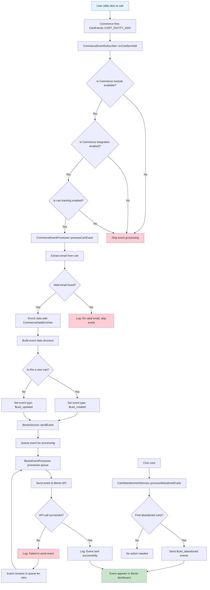

# Bento SDK for Drupal 10


> [!TIP]
> Need help? Join our [Discord](https://discord.gg/ssXXFRmt5F) or email jesse@bentonow.com for personalized support.

The Bento SDK for Drupal 10 makes it easy to send events, manage subscribers, and send transactional emails from your Drupal site using Bento’s API. Designed for both technical and non-technical users, this module provides a simple admin UI and a robust PHP API for developers.

---

Table of contents
=================
<!--ts-->
* [Features](#features)
* [Requirements](#requirements)
* [Getting Started](#getting-started)
    * [Installation](#installation)
    * [Configuration](#configuration)
* [Usage](#usage)
    * [Send Events](#send-events)
    * [Subscriber Management](#subscriber-management)
    * [Transactional Email](#transactional-email)
    * [Email Validation](#email-validation)
    * [Tag & Field Management](#tag--field-management)
* [Things to Know](#things-to-know)
* [Support](#support)
* [Contributing](#contributing)
* [License](#license)
<!--te-->

## Features

* **Easy Drupal Integration**: Seamless admin UI for configuration and management
* **Event Tracking**: Send custom events to Bento from your Drupal site
* **Subscriber Management**: Create, import, and update subscribers with tags and fields
* **Transactional Email**: Send emails via Bento, with fallback to Drupal’s default mail system
* **Email Validation**: Validate emails using Bento’s API
* **Secure by Default**: Credentials stored securely, with best-practice logging and sanitization

## Requirements

- Drupal 10.2 or higher
- PHP 8.1 or higher
- Composer (for dependency management)
- Bento API credentials (get these from your [Bento dashboard](https://app.bentonow.com))
  - **Site UUID**: 32-character hexadecimal string (e.g., `2103f23614d9877a6b4ee73d28a5c61d`) or standard UUID format with hyphens

## Getting Started

### Installation

#### Option 1: Drupal Admin UI (Recommended for non-technical users)
1. Download the module ZIP from the [Bento SDK releases page](https://github.com/bentonow/bento-drupal-sdk/releases).
2. In your Drupal admin, go to **Extend > Install new module**.
3. Upload the ZIP file and click **Install**.
4. Go to **Extend** and enable "Bento SDK".

#### Option 2: Composer (Recommended for developers)
1. In your Drupal root, run:
   ```bash
   composer require bentonow/bento-drupal-sdk
   ```
2. Enable the module via the admin UI or with Drush:
   ```bash
   drush en bento_sdk
   ```

### Configuration

1. In Drupal, go to **Configuration > Bento > Settings** (`/admin/config/bento/settings`).
2. Enter your **Site UUID** (32-character hex string or UUID format), **Publishable Key**, and **Secret Key** (from your Bento account).
3. (Optional) Enable **Route Drupal emails through Bento** to send all site emails via Bento.
4. (Optional) Enable **Email Validation** to check emails before sending.
5. Click **Save**.

> **Security Note:**
> For production, store your secret key in the `BENTO_SECRET_KEY` environment variable for maximum security.

---

## Usage

Once configured, you can use the SDK in custom modules or via the admin UI.

### Send Events
Send custom events to Bento (e.g., user registration, purchases):
```php
$bento = \Drupal::service('bento.sdk');
$bento->sendEvent([
  'type' => 'user_registration',
  'email' => 'user@example.com',
  'fields' => [
    'first_name' => 'John',
    'last_name' => 'Doe',
  ],
]);
```

### Subscriber Management
Create a subscriber:
```php
$bento->createSubscriber([
  'email' => 'user@example.com',
  'first_name' => 'John',
  'last_name' => 'Doe',
  'tags' => 'lead,customer',
]);
```
Import multiple subscribers:
```php
$bento->importSubscribers([
  [
    'email' => 'user1@example.com',
    'first_name' => 'Alice',
    'tags' => 'beta',
  ],
  [
    'email' => 'user2@example.com',
    'first_name' => 'Bob',
    'tags' => 'customer',
  ],
]);
```

### Transactional Email
Send a transactional email:
```php
$bento->sendTransactionalEmail([
  'to' => 'user@example.com',
  'subject' => 'Welcome to our site',
  'html_body' => '<p>Hello John, welcome!</p>',
  'text_body' => 'Hello John, welcome!',
  'personalizations' => [
    'first_name' => 'John',
  ],
]);
```

#### How Email Sending Works
- **Flexible Email Delivery:** This module uses Drupal's built-in, flexible email system. You can choose to send all your site's emails through Bento with a simple setting in the admin panel.
- **Automatic Fallback:** If for any reason Bento can't send an email (for example, if your credentials are missing or there's a temporary issue), the system will automatically use Drupal's regular email method instead. This means your emails will always be sent, with no extra work needed from you.

### Email Validation
Validate a single email:
```php
$result = $bento->validateEmail('user@example.com');
if ($result['valid']) {
  // Email is valid
}
```
Validate multiple emails:
```php
$results = $bento->validateEmails([
  'user1@example.com',
  'user2@example.com',
]);
```

### Tag & Field Management
Add/remove tags:
```php
$bento->addTag('user@example.com', 'vip');
$bento->removeTag('user@example.com', 'old-tag');
```
Add/remove custom fields:
```php
$bento->addField('user@example.com', 'plan', 'pro');
$bento->removeField('user@example.com', 'plan');
```
Subscribe/unsubscribe/change email:
```php
$bento->subscribeUser('user@example.com');
$bento->unsubscribeUser('user@example.com');
$bento->changeEmail('old@example.com', 'new@example.com');
```

---

## Things to Know

- **Email Delivery:** You can route all your site's emails through Bento, or stick with Drupal's default. If Bento is unavailable, emails will still be sent using Drupal's regular system—so you never miss a message.
- **Security**: Secret keys are stored securely. For best security, use environment variables.
- **Error Handling**: All errors are logged to Drupal’s log system. Sensitive data is sanitized.
- **Rate Limiting**: The SDK respects Bento API rate limits and uses chunked batch operations.
- **Fallbacks**: If Bento mail fails, Drupal’s default mail system is used automatically.
- **Permissions**: Only users with the right permissions can edit credentials or settings.

## Support

- [Bento Docs](https://docs.bentonow.com)
- [Discord Community](https://discord.gg/ssXXFRmt5F)
- Email: jesse@bentonow.com
- For bugs and feature requests, use the project’s issue queue.

## Contributing

We welcome contributions! Please see our [contributing guidelines](CODE_OF_CONDUCT.md) for details on how to submit pull requests, report issues, and suggest improvements.

## License

The Bento SDK for Drupal is available as open source under the terms of the [GPL-2.0-or-later license](LICENSE).

---

## Commerce Cart Event Flow

The Bento SDK automatically tracks Drupal Commerce cart events and sends them to Bento for customer engagement and marketing automation.



### Event Types Sent

- **`$cart_created`** - When the first item is added to a new cart
- **`$cart_updated`** - When additional items are added or cart is modified  
- **`$cart_abandoned`** - When a cart is abandoned (processed via cron)

### Configuration Required

1. **Enable Commerce Integration** at `/admin/config/bento/settings`
2. **Configure Bento API credentials** (Site UUID, Publishable Key, Secret Key)
3. **Enable cart event tracking** (Cart Created, Cart Updated events)

### Event Data Structure

Cart events include comprehensive data:
- Cart ID and total value
- Customer email and information
- Product details (SKU, title, quantity, price)
- Cart creation and modification timestamps
- Cart recovery URL for abandoned carts

For detailed verification and testing instructions, see [CART_EVENT_VERIFICATION.md](CART_EVENT_VERIFICATION.md).